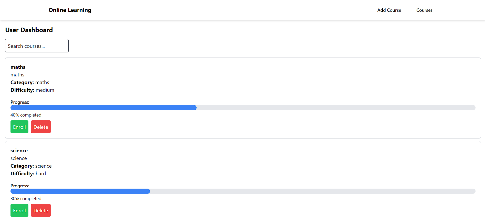
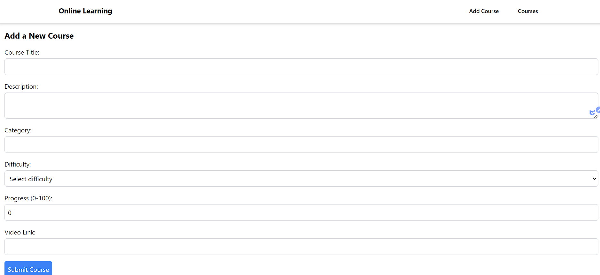

# Online Learning Platform

## Overview

The Online Learning Platform is a web application that allows users to manage their learning experience effectively. Users can add, edit, and delete courses, track their progress, and watch lesson videos. The platform features a user-friendly dashboard designed with React and styled with Tailwind CSS. All data is stored in local storage for easy access and management.





## Features

- **User Dashboard**: An intuitive dashboard where users can navigate their courses.
- **Course Management**:
  - Add new courses.
  - Edit existing courses.
  - Delete courses.
- **View Courses**: Users can view a list of all their courses.
- **Progress Tracking**: Users can track their learning progress.
- **Video Lessons**: 
  - Watch videos related to each course.
  - Resume lessons from where the user left off.
- **Filtering Options**: Users can filter their courses for easy navigation.

## Technologies Used

- **Frontend**: 
  - React
  - Tailwind CSS
- **Data Storage**: Local Storage

### Prerequisites

- Node (v12 or above)
- npm (Node Package Manager)

## Installation

```bash
 npm install
```

```bash
npm run start
```
